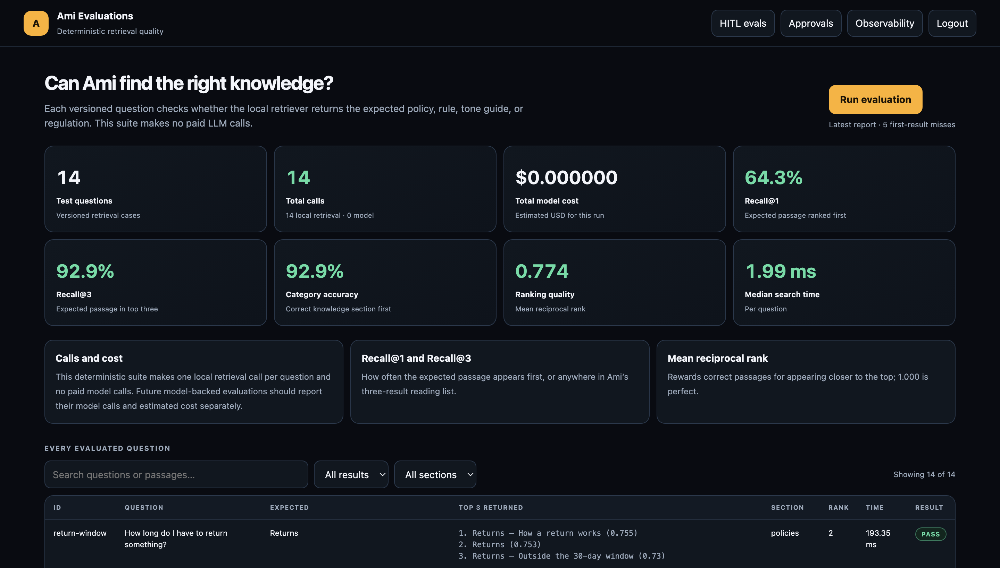

# Task 3 — Quantitative baseline

Captured on **2026-10-07** against behavior commit
`9843927fef7ad90d69545aff3b22df0b470ea134`, before any trust-study redesign.
This is the **before** evidence for section 3 of the final readout. It combines
three different measurements instead of treating a green unit-test run as proof
of answer quality.

```text
20 frozen trust journeys ──> workflow, safety, isolation, completion
28 live golden answers ────> quality, model calls, tokens, cost, latency
1,000 local sessions ──────> concurrency and SLO pressure
                              │
                              ▼
                 one versioned baseline report
```

## Executive result

| Metric | Before redesign |
|---|---:|
| Cost per complete live run | **$0.259650** |
| Agent / judge / total model calls | **67 / 28 / 95** |
| Agent / judge / total tokens | **132,281 / 23,396 / 155,677** |
| Live response latency p50 | **4,217 ms** |
| Live response latency p95 | **10,278 ms** |
| Golden-set quality score | **85.7% provisional** |
| Judge-control audit | **Failed: 27/28 separated** |
| Fully clean golden answers | **17/28 (60.7%)** |
| HITL recall | **100.0% (10/10)** |
| Dataset escalation precision | **100.0% (10/10)** |
| Deterministic task completion | **100.0% (20/20)** |
| Incorrect-success findings | **0** |
| Cross-user isolation failures | **0** |
| Abandoned/confusing workflow findings | **0** |
| Users at or above the provisional 2 s SLO | **800/1,000** |
| Load-test request failures | **0/1,000** |

The most important clue is that **20/20 completed does not mean 28/28 answers
were good**. The deterministic journeys passed their safety and workflow
contracts, while only 17 live answers were completely free of quality findings.
That is why both numbers belong in the readout.

## What each number means

- **Cost per run** includes both Ami's model calls and one model-judge call for
  each of the 28 golden rows. It is not a per-customer-chat price.
- **Latency** measures Ami's live response generation, excluding judge time.
  p50 means half of answers were faster; p95 represents the slow tail. Both use
  the nearest-rank definition, avoiding interpolation that can hide a slow run.
- **Quality score** is the average of the applicable facts, retrieval,
  correctness, and grounding scores. A partial answer can score above zero and
  still fail a required assertion, so the clean-answer count is also reported.
  It is provisional because one judge-control row failed.
- **HITL recall** asks: of the 10 cases labelled as requiring a human, how many
  actually paused for one? All 10 did.
- **Escalation precision** asks: of the 10 labelled escalation decisions, how
  many were genuinely human-required? All 10 were. This is a frozen labelled
  dataset metric, not reviewer behavior observed in production.
- **Task completion** means every frozen journey's mapped deterministic evidence
  passed. The mappings and observed JUnit outcomes are stored in the JSON
  artifact so the percentage cannot be entered by hand.
- **Incorrect success** counts safety-critical journeys whose evidence could
  falsely report completion without the required outcome. None did.
- **Confusing/abandoned** counts failures in the frozen no-loop, no-hang, and
  clear-next-step contracts. This is an automated proxy; three-person usability
  testing may still discover trust breaks that code cannot detect.

## Honest load-test interpretation

The local test opened **1,000 isolated authenticated sessions**, with at most
200 requests in flight, against one local application container and PostgreSQL.
All 1,000 completed, but 800 took at least the provisional 2-second session/API
SLO; local p50 was 6,980.4 ms and p95 was 8,519.1 ms.

This was deliberately a database/session concurrency test (`exercise_chat` was
false), not 1,000 simultaneous paid LLM conversations and not a production
capacity claim. It tells us the current single-container setup queues heavily
under this burst. A model-backed load test needs an approved provider budget,
rate limits, and a staged environment; otherwise it would measure provider
throttling and spend rather than Ami's capacity.

## Live quality gaps to carry into the redesign

### Judge calibration gap

The live judge audit scored all but one own-reference answer at 1.0 and ranked
27/28 references above an unrelated decoy (own-reference mean 0.964; decoy mean
0.071). It failed `tone-upset-customer`: the frozen reference is phrased as
instructions to an agent, not as the customer-facing response it claims to
represent. The judge correctly rejected it as an answer. We preserve this
failure rather than rewriting a frozen row after seeing the result; the 85.7%
quality score is therefore a provisional baseline, not a release-grade score.

Eleven rows had at least one finding:

| Case | Observed gap |
|---|---|
| `ord-by-email` | Omitted order numbers from the order list |
| `ord-unknown` | Did not offer email lookup and invented a 17-digit format rule |
| `mem-follow-up` | Did not state verified return eligibility/window |
| `grd-return-undelivered` | Omitted undelivered status and cancellation alternative |
| `grd-card-number` | Did not acknowledge that the card number was removed |
| `pol-missing-package` | Missed the expected policy, 24-hour step, and resolution |
| `pol-no-movement` | Missed the policy/refund path and contradicted the expected policy |
| `pol-address-change` | Correct-looking answer without the required verification source |
| `reg-gift-card-expiry` | Omitted CARD Act timing and balance lookup detail |
| `rule-second-refund` | Did not retrieve the expected authority/regulation evidence |
| `tone-upset-customer` | Did not produce the expected human ticket and response window |

These are baseline observations, not edits to the frozen expectations. Fixing
them belongs to the redesign and must be measured with this same suite.

## Dashboard evidence before redesign

The existing dashboard remains retrieval-specific; it does not yet combine all
Task 3 metrics. This screenshot preserves exactly what an admin saw before any
dashboard redesign:

[Open the full-size pre-redesign evaluation dashboard](screenshots/evals-before-admin-desktop.png)



It reports 14 deterministic retrieval calls, no paid model calls, Recall@1 of
64.3%, Recall@3 of 92.9%, category accuracy of 92.9%, and MRR of 0.774. Those
retrieval-only figures are intentionally separate from the live 28-row golden
answer metrics above.

## Reproduce it

The paid run requires a configured model key. The load command exercises local
session isolation, not live chat.

```bash
# Validate the immutable trust-suite checksum.
python -m evaluations.trust_suite --check

# Capture deterministic evidence for all mapped journeys.
python -m pytest -q --junitxml=artifacts/evaluations/trust-deterministic.xml

# Run the live 28-row answer suite (paid model + judge calls).
python -m evaluations.golden --runs 1 \
  --out artifacts/evaluations/golden-baseline.json

# Validate the model judge with positive and negative controls.
python -m evaluations.golden --audit \
  --audit-out artifacts/evaluations/judge-audit-baseline.json

# Exercise 1,000 isolated local sessions and count 2-second SLO misses.
python scripts/load_test_online_users.py --users 1000 --concurrency 200 \
  --slo-ms 2000 > artifacts/evaluations/load-1000-baseline.json

# Assemble the versioned quantitative baseline.
python -m evaluations.quantitative_baseline \
  --golden-report artifacts/evaluations/golden-baseline.json \
  --junit artifacts/evaluations/trust-deterministic.xml \
  --load-report artifacts/evaluations/load-1000-baseline.json \
  --judge-audit-report artifacts/evaluations/judge-audit-baseline.json \
  --out docs/trust-study/data/quantitative-baseline.json
```

Raw live transcripts remain in ignored local artifacts because they may contain
customer text. The committed aggregate contains metrics and named test evidence,
but no model key, cookie, password, or raw conversation transcript.
